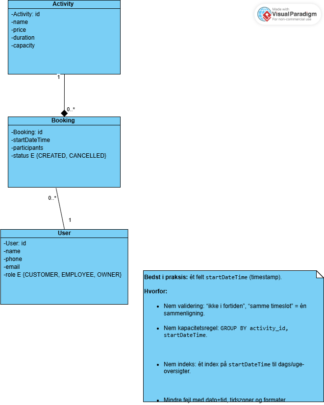

# Domænemodel – AdventureXP
**Klasser & felter (forretningsniveau):**
- Activity: id, name, description, price, duration, capacity
- Booking: id, startDateTime, participants, status {CREATED, CANCELLED}
- User: id, name, phone, email, role {CUSTOMER, EMPLOYEE, OWNER}

**Relationer:**
- Activity 1—* Booking
- User 1—* Booking

**Regler (invarianter):**
- participants > 0
- Sum(participants) pr. (activity, startDateTime) ≤ Activity.capacity
- Booking i fremtiden; annullering sætter status = CANCELLED

