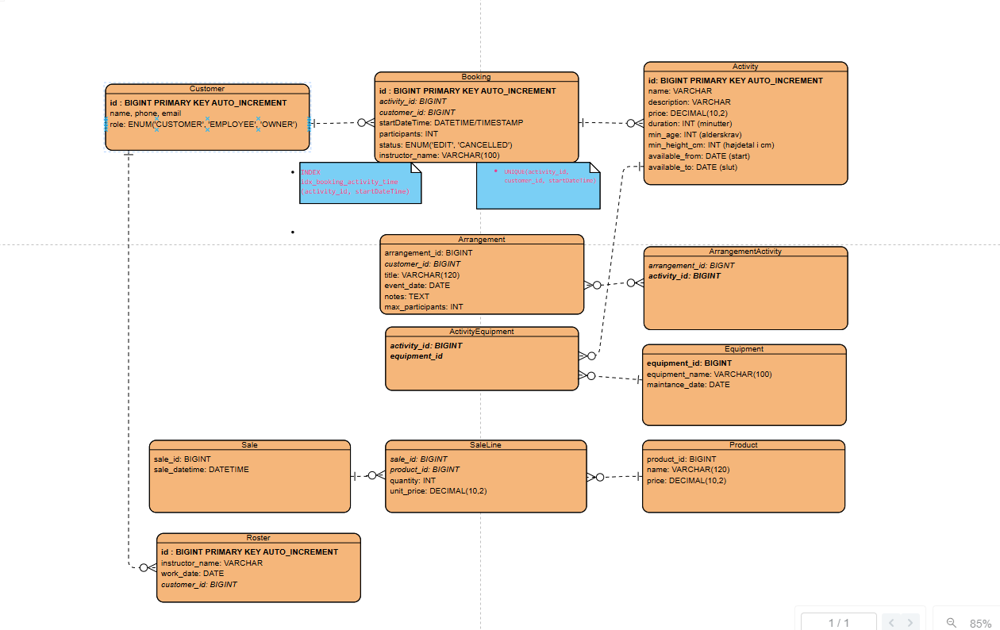

# ER-model – AdventureXP (visualisering)
**Tabeller:**
- user(id PK, name, phone, email, role)
- activity(id PK, name, description, price DECIMAL, duration INT, capacity INT)
- booking(id PK, activity_id FK, customer_id FK, startDateTime DATETIME, participants INT, status)

**Relationer:**
- activity (1) — (∞) booking
- user (1) — (∞) booking

**Nøgler/indeks (intention):**
- INDEX booking(activity_id, startDateTime)
- UNIQUE (activity_id, customer_id, startDateTime)  *(undgå dobbeltbooking af samme kunde i samme slot)*

